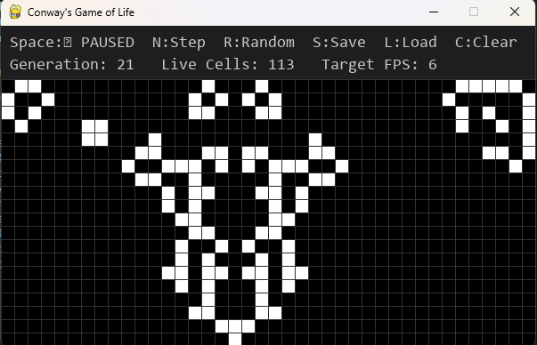

# Conway's Game of Life - Python & Pygame Visualizer 🧬

A Python-based interactive visualizer for Conway's Game of Life, built using Pygame. This project allows users to observe the fascinating emergent patterns of this classic cellular automaton, control the simulation, and save/load patterns.

*(Consider adding a screenshot or GIF of your application running here. You can name it `placeholder_screenshot.png` or similar and upload it to your repository.)*

## What is Conway's Game of Life?

Conway's Game of Life is a zero-player cellular automaton devised by John Conway. It consists of a grid of cells, each of which can be "alive" or "dead". The state of each cell in the next generation is determined by a simple set of rules based on its eight neighbors:
1.  **Underpopulation:** A live cell with fewer than two live neighbors dies.
2.  **Survival:** A live cell with two or three live neighbors lives on.
3.  **Overpopulation:** A live cell with more than three live neighbors dies.
4.  **Reproduction:** A dead cell with exactly three live neighbors becomes alive.

Despite its simple rules, the Game of Life can produce complex and surprising patterns.

## Features

*   **Interactive Visualization:** View the Game of Life unfold in real-time.
*   **Customizable Grid:** Set the grid width, height, and simulation speed (FPS) via command-line arguments.
*   **Game Controls:**
    *   Play/Pause the simulation.
    *   Step through generations one by one.
    *   Clear the entire grid.
    *   Randomly populate the grid.
*   **Pattern Management:**
    *   Save the current board state as a pattern.
    *   Load pre-defined or custom patterns from files.
*   **Manual Cell Toggling:** Click on cells to toggle their state (alive/dead).
*   **Informative HUD:** Displays current generation count, number of live cells, and simulation status.

## Requirements

*   Python 3.x
*   Pygame (`pip install pygame`)

## Controls

*   **Spacebar:** Play / Pause the simulation.
*   **N:** Advance one generation (Step).
*   **C:** Clear the board (all cells die).
*   **R:** Randomly fill the board.
*   **S:** Save the current pattern to the `patterns/` directory.
*   **L:** Load a pattern (currently loads `patterns/glider.txt` by default - can be modified in code).
*   **Q:** Quit the application.
*   **Mouse Left-Click (on grid):** Toggle the state of the clicked cell.

## Pattern File Format

Patterns are stored in plain text files (e.g., in the `patterns/` directory). Each line represents a live cell using `x,y` coordinates (column, row). Lines starting with `#` are considered comments.

Example (`patterns/glider.txt`):
